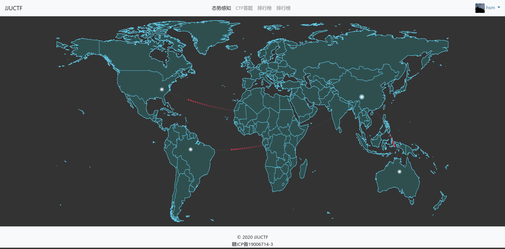
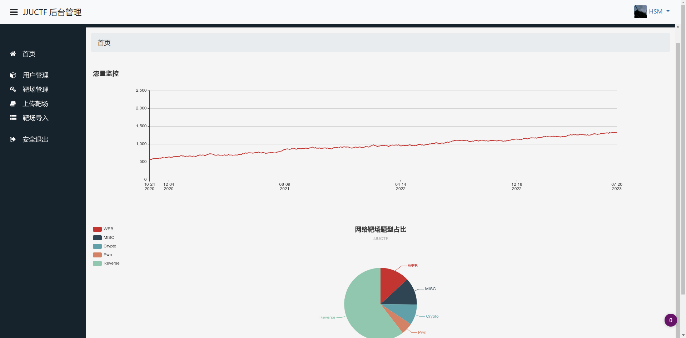

# JJUCTF网络安全靶场
## 简述
JJUCTF是一个网络安全靶场，可以提供添加容器(Docker)，用户管理，使用WEB作为前端页面，后端开发使用Python flask框架
### 前端
- index

- challenge

- awd

- rank

### 后端
管理员登录框

管理员页面

upload

user

## 技术栈：
- 虚拟化：Docker
- 后端编程语言：Python
- WSGI :gunicron
- 负载均衡：Nginx
- 后端框架：Flask
- 数据库：Mysql
- 前端UI:Bootstrap
- js框架:Vue.js
- WebSocket

## 搭建
1. pip install -r requirement.txt
2. gunicorn -w 2 -b 0.0.0.0:8080   app:app

## 设计功能：
### 1.容器管理
1. 容器可以新建和删除
2. 可以通过python命令的方式执行，比如os.popen(),os.system()
3. 创建一个Contain类，这个类可以完成靶机容器的上传，下载，删除，开启（开启可以为多种模式，这里做好用数据库，）
### 2.团队管理
可设置多人组队或者单人组队
### 3.竞赛规则
1. 不可以DDOS平台
...

### 4.模式
#### 解题模式
提交相应的flag即可得分，为了防止作弊，每队都要有各自的token

#### AWD模式
每个队都有自己的靶机
#### 练习模式
可以对已经开放的靶机进行攻击，提交flag获得积分
### 4.前端功能
- 首页：
- 排行榜
- CTF练习
- CTF答题赛
- AWD模式
- 态势感知

