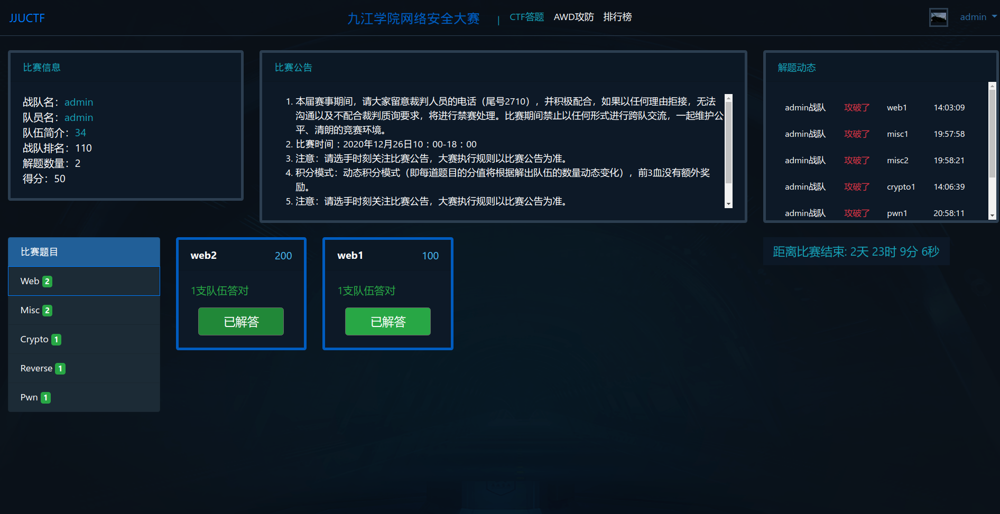
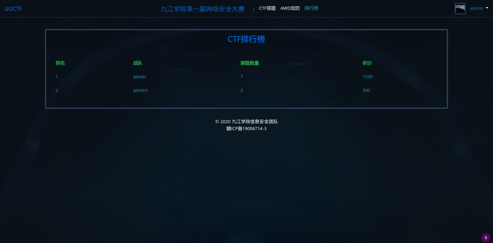

# JJUCTF网络安全靶场
## 简述
JJUCTF是一个网络安全靶场，可以提供添加容器(Docker)，用户管理，使用WEB作为前端页面，后端开发使用Python flask框架
### 前端
- challenge

- awd

- rank

### 后端
管理员登录框

管理员页面

upload

user

## 技术栈：
- 虚拟化：Docker
- 后端编程语言：Python
- WSGI :gunicron
- 负载均衡：Nginx
- 后端框架：Flask
- 数据库：Mysql
- 前端UI:Bootstrap
- js框架:Vue.js
- WebSocket


## 搭建
#### 修改pip镜像源
```angular2html
pip install pip -U
pip config set global.index-url https://pypi.tuna.tsinghua.edu.cn/simple
```
####  安装依赖
```angular2html
pip install -r requirement.txt
```
***需要注意***：

python 在 `Windows`下使用AES时要安装的是`pycryptodome`模块
```angular2html
pip install pycryptodome 
```


python 在 `Linux`下使用AES时要安装的是`pycrypto`模块 
```angular2html
 pip install pycrypto 
```

#### 创建AWD靶场网络
```angular2html
docker network create --subnet=172.18.0.0/16 awd
```
#### 多线程模式工作
```angular2html
gunicorn -w 2 -b 0.0.0.0:8080   app:app
```


## 设计功能：
### 1.容器管理

1. 容器可以新建和删除
2. 可以通过python命令的方式执行，比如os.popen(),os.system()
3. 创建一个Contain类，这个类可以完成靶机容器的上传，下载，删除，开启（开启可以为多种模式，这里做好用数据库，）

### 2.团队管理
可设置多人组队或者单人组队

### 3.竞赛规则
1. 不可以DDOS平台
...

### 4.模式

#### 解题模式
提交相应的flag即可得分，为了防止作弊，每队都要有各自的token
，每个队伍找到比赛题目中的flag并且提交，提交成功将获得比赛积分。
#### AWD模式
每个队都有自己的靶机，前三十分钟对自己需要守护的靶机进行防护，此时不能攻击其他队伍靶场，三十分钟后，每十分钟刷新各个靶机的flag，并且检查各个队伍靶机的状态，若发现靶机服务不正常，则扣除相应分值
### 4.前端功能
- 首页：
- 排行榜
- CTF答题赛
- AWD模式


